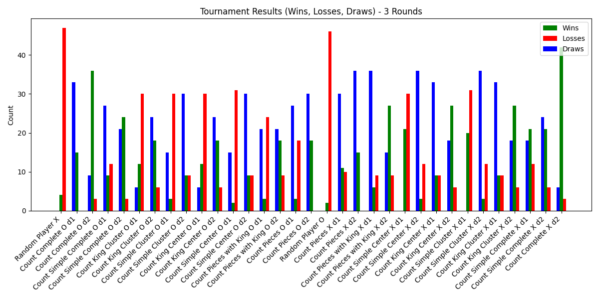
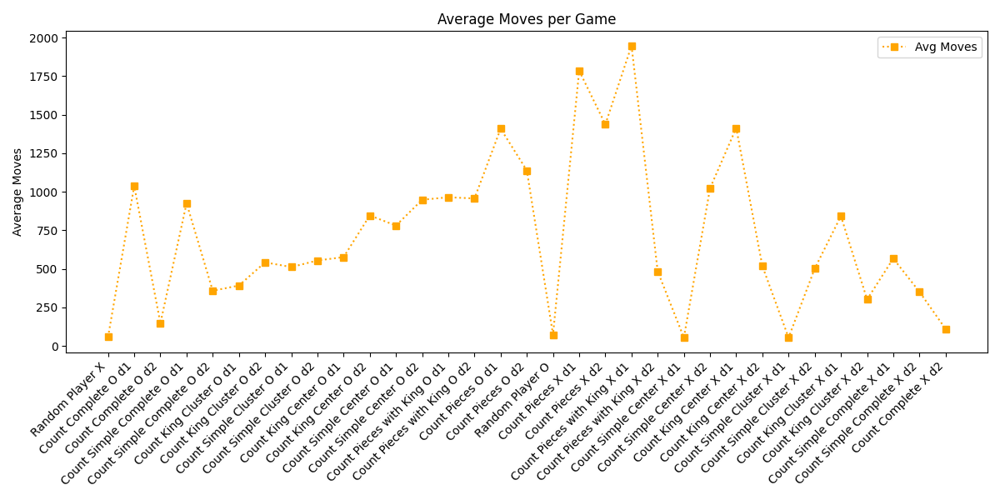
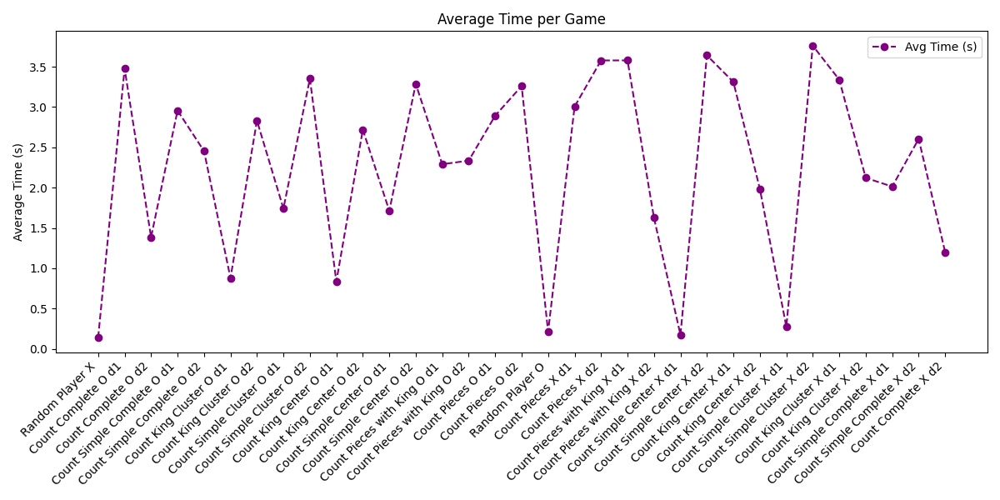
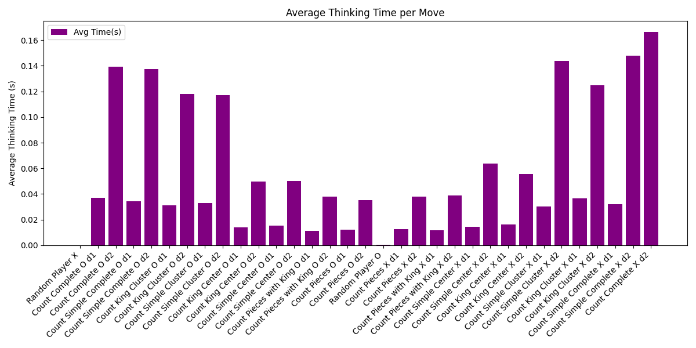

# ♟️ Checkers Bot

A Python-based checkers AI using **Alpha-Beta Pruning** with various heuristic strategies. Play against the bot or run a full AI vs AI tournament.

## 🚀 Features

- Alpha-beta pruning AI
- Multiple heuristic strategies (piece count, kings, center control, clustering, piece advancement, etc.)
- Play vs AI (4 difficulty levels)
- Run tournaments with result visualization

## 🛠️ Requirements

- Python 3.7+
- `matplotlib`
- `numpy`

## ▶️ Usage


### Install dependencies
```bash
pip install -r requirements.txt
```

### Clone the repo
```bash
git clone https://github.com/chaseblodgett/checkers_bot.git
cd checkers_bot
```

### Run the program
```bash
python3 checkers.py
```


## 📊 Tournament Analysis

### 
**Figure 1: Wins, losses, and draws of a 3-round tournament between different evaluation functions.**  
Players with a more complete understanding of checkers, such as the "Count Complete" bots, performed the best, while the Random Player was the weakest. Draws were more common among complex evaluators, likely due to slow decision-making leading to timeouts. Players on the X side had a noticeable advantage from going first.

---

### 
**Figure 2: Average moves per game of each AI player in a 3-round tournament.**  
A clear correlation exists between a high number of moves and a high draw rate. These lengthy games suggest not indecision, but difficulty reaching a win condition. Simpler evaluators played more moves, and O-side players were generally more consistent across depth variations.

---

### 
**Figure 3: Average time elapsed per game of each AI player.**  
Regardless of evaluation complexity, depth-2 players consistently took between 2 and 3.5 seconds per game. This shows that **search depth** was the biggest factor in determining game duration, more than evaluation strategy.

---

### 
**Figure 4: Average time spent thinking per move by each AI player.**  
Depth-2 players took significantly longer per move compared to depth-1 players. Evaluators with simpler logic ran faster, but depth had a much greater impact than heuristic complexity. This supports conclusions drawn from total game time.


